# calculator
A calculator which does basic arithmetic operations, like 
Addition, Subtraction, Multiplication and Division. 
The same can be done with their fraction parts. 
The start/Restart button refreshes the webpage. 
 
1.Addition:
 
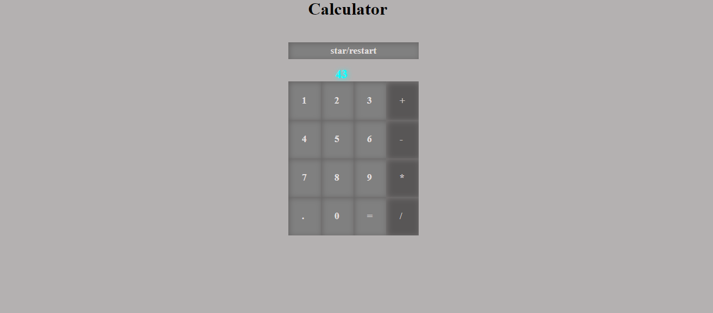 
  
2.Subtraction:
 
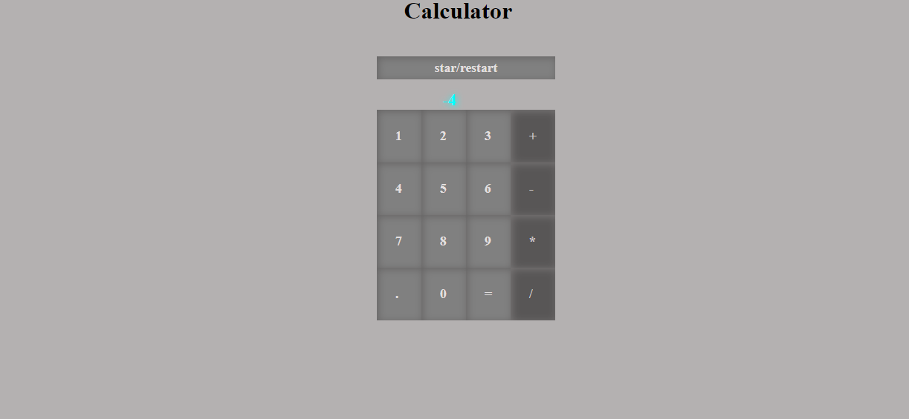 
  
3.Multiplication:
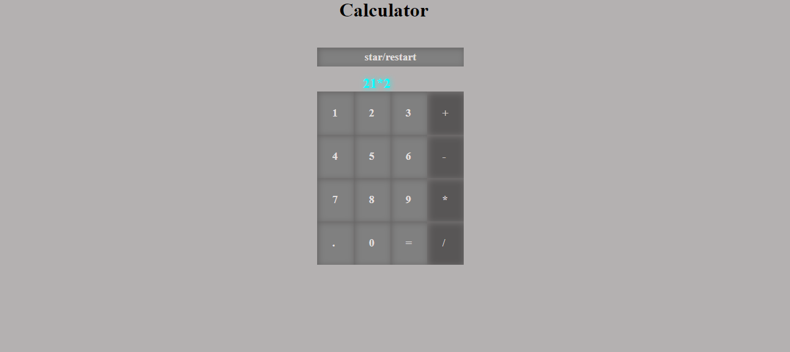 
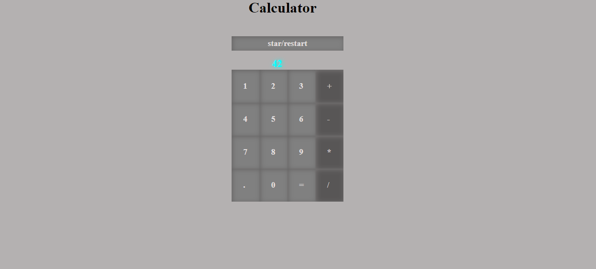 
  
4.Division:
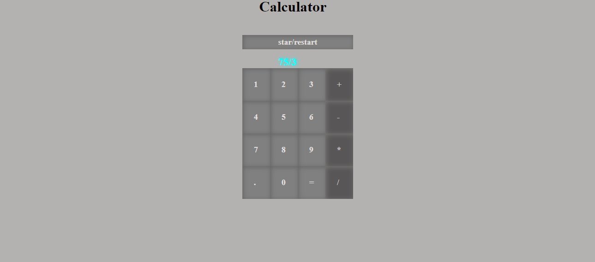 
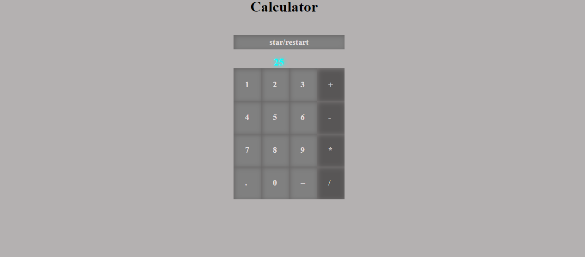 
  
5.Division by zero Error:
 
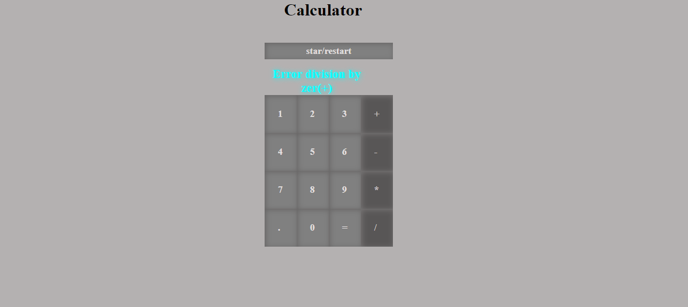 
  
Operations with Fractional part:
1.Addition:
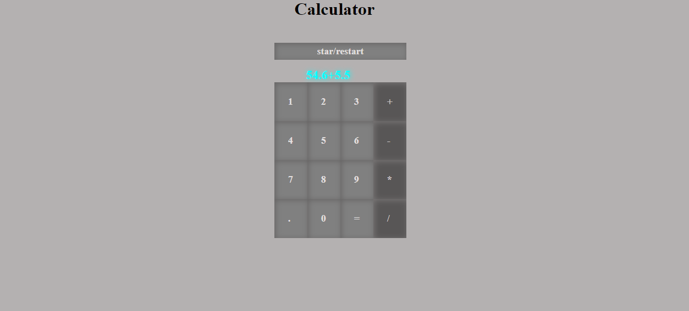 
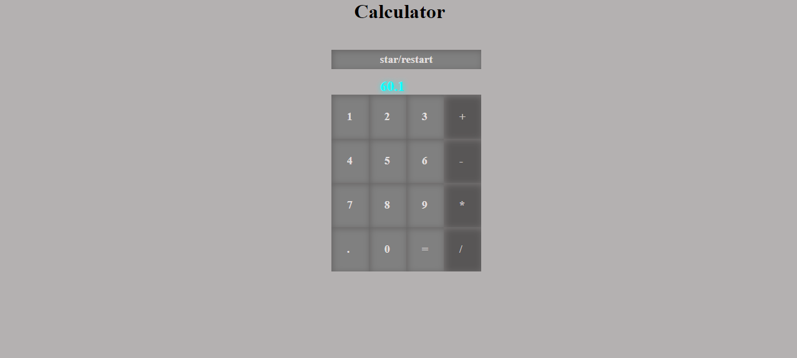 
  
2.Multiplication:
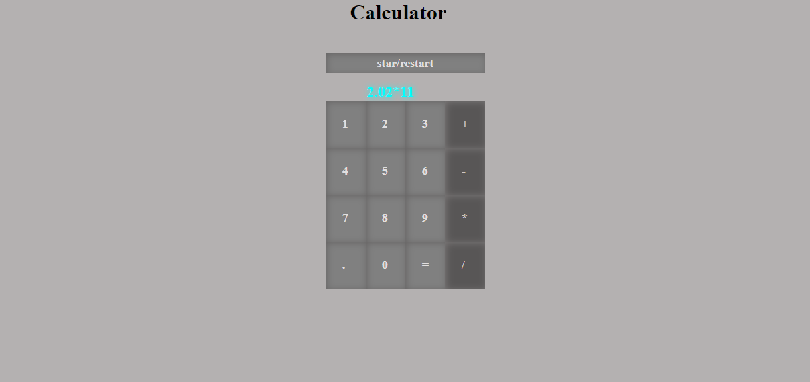 
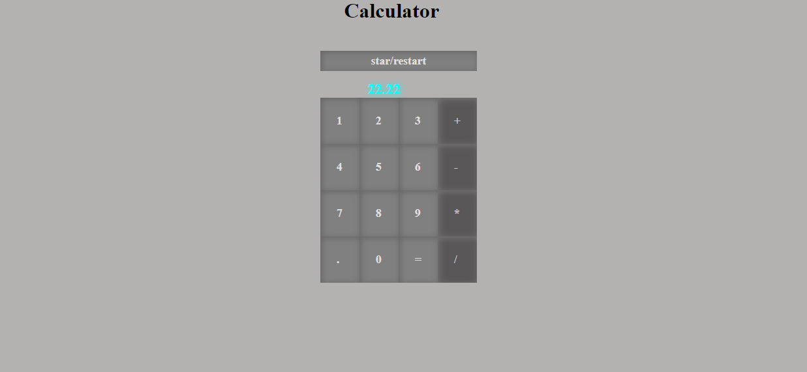 
  
3.Division:
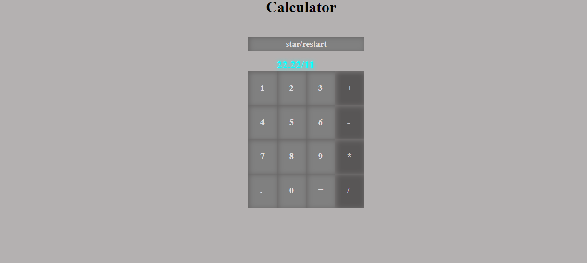 
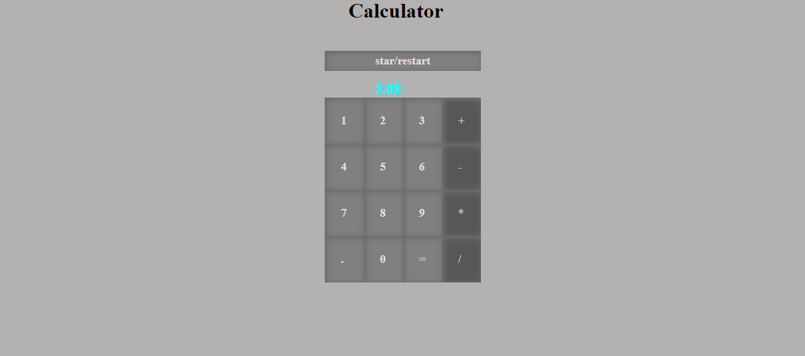 
  
